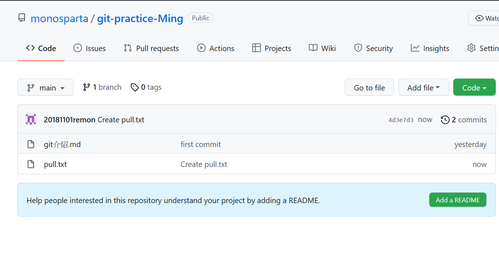
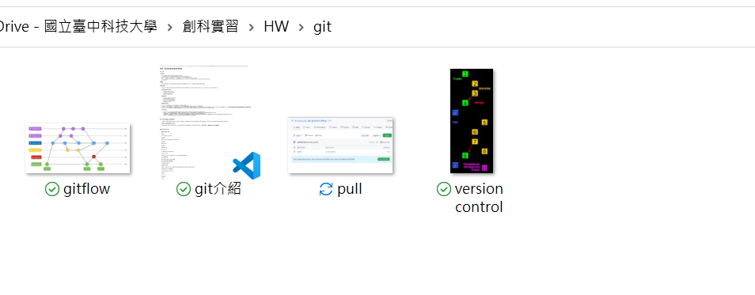
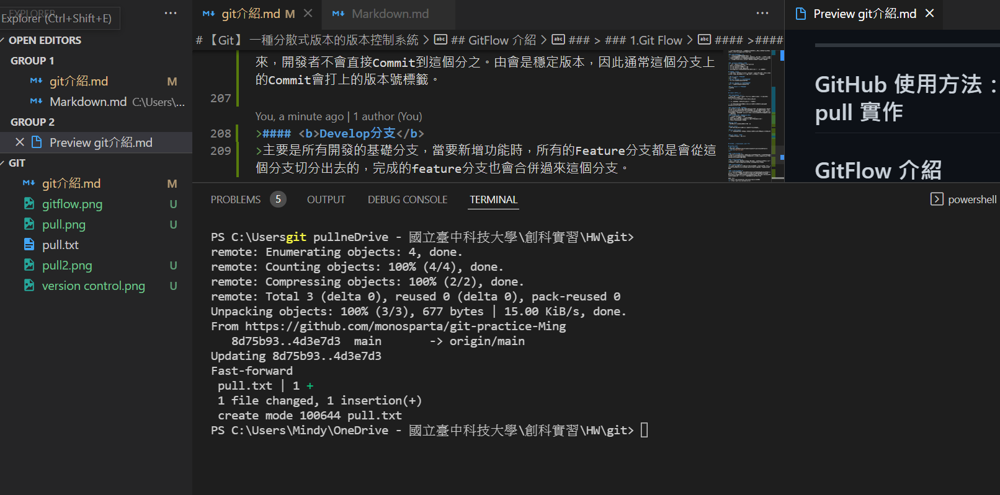
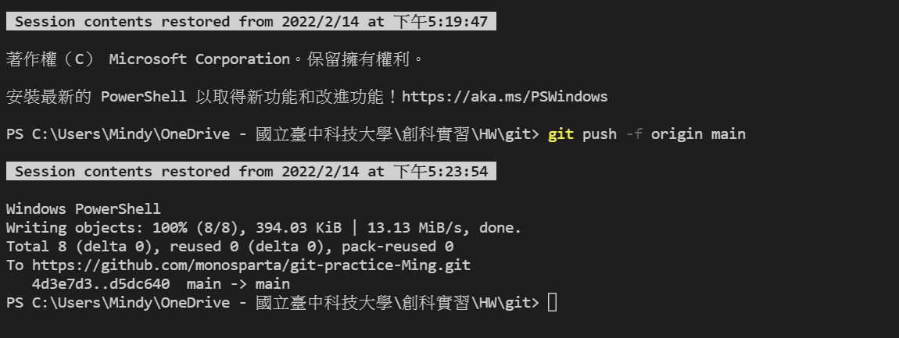
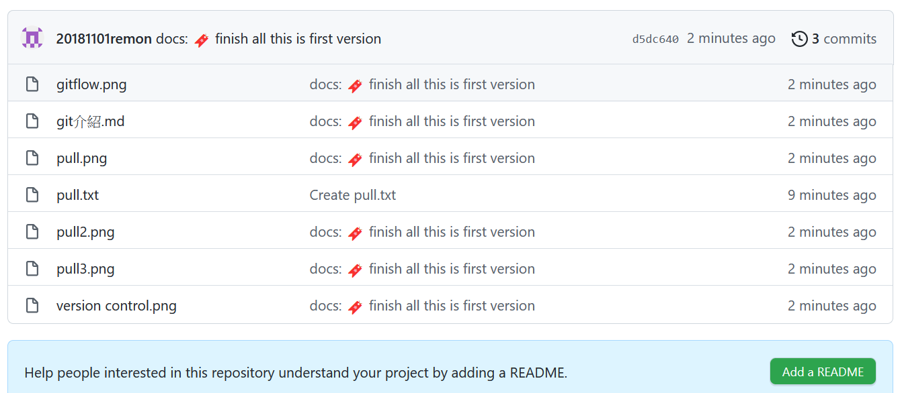

<!--
 * @Author: your name
 * @Date: 2022-02-23 14:49:45
 * @LastEditTime: 2022-02-23 14:50:28
 * @LastEditors: your name
 * @Description: 打开koroFileHeader查看配置 进行设置: https://github.com/OBKoro1/koro1FileHeader/wiki/%E9%85%8D%E7%BD%AE
 * @FilePath: \git\ImplementPullANDPush.md
-->
## GitHub 使用方法：push, pull 實作
在Git上面新增一個txt檔後pull下來
### Git pull 前的遠端與本地端

### Git pull後的遠端與本地端

### Git push成功（使用Conventional Commit）
> 
> 
## GitFlow 介紹
> ### 1.Git Flow
> 根據建議主要分支有：master、develop、hotfix、release與feature
>
 

>#### <b>Master分支</b>
>主要用來放穩定、確定要上線的版本。通常此分支的來源是從別的分支合併過來，開發者不會直接Commit到這個分之。由會是穩定版本，因此通常這個分支上的Commit會打上的版本號標籤。

>#### <b>Develop分支</b>
>主要是所有開發的基礎分支，當要新增功能時，所有的Feature分支都是會從這個分支切分出去的，完成的feature分支也會合併過來這個分支。

>#### <b>Hotfix分支</b>
>當線上的產品發生緊急問題時，會從Master分支開一個Hotfix分支出來進行修復，Hotfix分支修復完後，會合併回Master分支，同時合併一分到Develop分支。

>#### <b>Release分支</b>
>當認為Develop分支夠成熟了，就可以把Develop分支合併到Release分支，在這邊進行算是上線前的最後測試。測試完成後會同時合併到Master分支與Develop這兩個分支上。同步到Develop分支的目的，是因為可能在Release分支上還會測到並修正一些問題，所以需要跟Develop分支同步。

