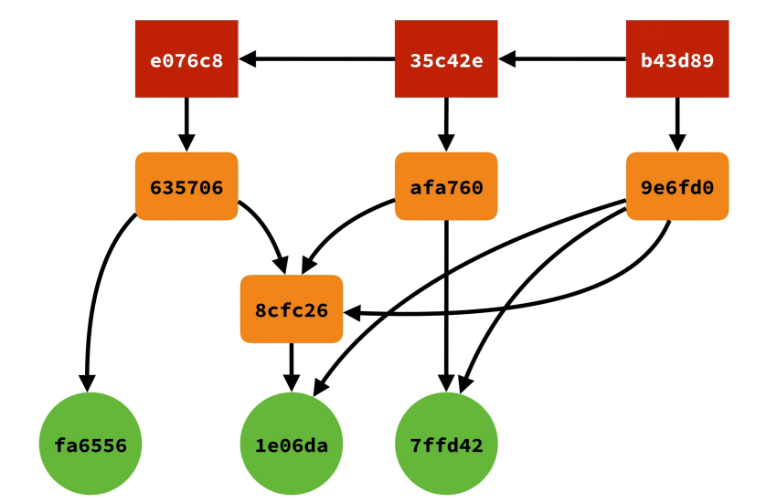

<!--
 * @Author: your name
 * @Date: 2022-02-23 14:44:42
 * @LastEditTime: 2022-02-23 14:45:42
 * @LastEditors: Please set LastEditors
 * @Description: 打开koroFileHeader查看配置 进行设置: https://github.com/OBKoro1/koro1FileHeader/wiki/%E9%85%8D%E7%BD%AE
 * @FilePath: \git\VersionControl.md
-->
# 版本控制（workflow）的邏輯說明

>在說明邏輯前，我們必須先知道一些基本知識
 

>* 什麼是版本：每完成一個任務，檔案與目錄每一次的狀態變化
>* Git 只是個內容追蹤軟體，僅在乎內容不在乎檔案或目錄的名稱
> * Git 是拍快照的方式記錄檔案之間的差異
> * Git 物件的檔名以SHA1演算法
> * Git物件的內容為檔案內容+壓縮

> ##  Git 中的四個基本物件：
>> 1. blob物件：跟檔案內容有關,當執行git add指令的同時，新增檔案的內容會被寫入blob物件，檔名則為物件內容的雜湊運算結果，<b>檔案時間、原本的檔名或其他資訊則是儲存到tree的物件</b>

>> 2. tree物件：與目錄資訊相關，會儲存特定目錄下的所有資訊、包含該目錄下的檔名、對應的blob物件名稱、檔案連結（symbolic link）或其他tree物件。簡單來說就是tree物件是特定版本下某個資料夾的快照。

>> 3. commit：用來記錄有哪些tree物件包含在版本中，一個Commit物件代表著git一次的提交，紀錄定接版本中有那些tree物件、以及版本提交的時間、紀錄訊息等等。通常還會記錄上一層commit物件名稱。

>> 4. tag：是一個容器，通常用來關聯一個Commit物件（也可以關聯到特定blob、tree物件），並儲存一些額外的參考資訊。EX：tag名稱。通常大多使用tag是為了將某版本的commit物件標記特殊意義的名稱或發行版本。

> ## 闡述觀念間的關係
>1. 要使用Git版本控制，必須建立「工作目錄」與「版本庫」。(mkdir、git init)
>2. 你要先在「工作目錄」進行開發，如建立目錄、建立檔案、修改檔案等操作。
>3. 然後當你想提交一個新版本Git到「儲存庫」裡，一定要先更新「索引」狀態。（git add,git mv,）
>4. Git 會依據「索引」當下的狀態，決定把那些檔案提交到Git的「儲存庫」裡。
>5. 最後提交變更時（git commit），才會把版本資訊寫到「物件儲存區」當中（寫入commit物件）。

> * 要看出blob檔案版本間的關係，就要透過tree物件（資料夾的快照）與Commit物件（每一個版本之間的快照），才能關聯出blob與版本的關係。

> ## Git 如何存放這些物件
> * 所有物件都會以zlib演算法進行壓縮，不僅提升檔案存取效率也在日後的封裝（pack）的時候也可以利用差異壓縮（delta compression）演算法來節省間，並自動找出相似的blobs，並自動計算出blob之間的變化差異，再將這些差異儲存名為packfile的檔案中，大幅節省磁碟空間的耗用。

> ## 整個運作邏輯範例
> 1. 當你開始把檔案交到戰存區後，blob物件便開始生成
> 2. 提交commit指令，開始生成tree物件，由tree物件紀錄檔案與目錄等資訊，因此會指向目錄與物件也可能指向其他的tree物件
> 3. <b> 完成 </b>commit 之後，會生成commit物件，commit物件會指向方才的tree與前一個commit物件
> 4. tag物件會指向某個commit物件

> ## 第一次commit實際運作說明
> 1. 當你新增一個檔案的時候，檔案通常為untrack
> 2. git add 會將檔案放置git站存區，此時blob物件便開始生成
> 3. git commit 後，git 根據造出tree物件，tree物件會指向它所包含的blob物件，以及上衣個tree物件
> 4. commit在指向tree物件
> 5. 目前的master物件指向新的commit，head再指向master

> ## 第二次commit實際運作說明
> 6. 修改blob內容，檔案狀態為modified
> 7. 再使用add使用加入暫存區後，由於檔案不一樣，因此根據SHA1演算法會生成新的blob物件
> 8. 因而又生成新的tree物件來對應新的blob物件，但由於有一個blob（原先有兩個但只有跟動一個）並沒有改變，因此此tree 除了指向新的blob外，也會指向未改變的blob
> 9. 為了新的tree也會生成一個新的commit，此commit除了會指向新的tree外也會指向上一個commit
> 10. master 與 head 會往前至新的commit

> ## 第三次commit實際運作說明
> 11. 前面有提及，git是以檔案內容變更為依據。因此如果現在新增一個 <b>檔名不同但內容與第二次commit相同的內容</b>後會發生什麼事呢？
> 12. git add 後便<b>不會</b>生成新的blob！
> 13. git commit 後產生的新物件會指向<b>內容已存在的blob</b>以及沒有異動的blob物件
> 14. 因應新的tree會生成相對應的commit，會指向新的tree與上一個commit 
> 15. master 與 head 會往前至新的commit

> 

> ## 物件結構的優點

> ###  有效率的處理大型專案

>> 不僅僅是完整的版本庫會複製（clone）一份在本機，由於所有的blob物件都是透過「內容」來定址的（content addressable），因此不同版本之間找尋相同的內容，效率是非常高的。
> ### 歷史紀錄保護

>>Git版控的過程，每次提交變更都會產生一個Commit物件，而這個Commit物件的名稱又是透過commit物件的內容產生。再者，Commit物件會關聯到tree物件，tree物件的名稱又是關聯到blob與tree物件，在一層層的關聯下去，要竄改某個版本的歷史紀錄困難度很高。 由於儲存庫經常被clone或fork，只要是被clone過的儲存庫，來源的儲存庫只要任何一個物件被修改，這些clone出去的儲存就很難再合併回來，幾乎不可能任意竄改版本紀錄。

>### 定期的封裝物件

>>只要專案中的程式碼或檔案被更新，內容不一樣時，Git就會建立一個新的物件，不同內容的檔案將會被保存下來 由於當專案擴大時，過多的檔案會導致存取越來越沒效率，因此Git設計有幾個機制可使一群老舊的「物件」自動封裝進一個封裝檔（packfile），以改善檔案存取效率。 新檔案依舊會以單一檔案的方式存在，然後某隔一段時間就會被重新封裝（repacking）。

> ### SHA1演算法補充：
>* 40個16進位字元組成
>* 很微小的機率才會有碰撞

> ### Git中Blob物件的SHA1計算公式如下：
>> 1. 「blob」字樣
>> 2. 1個空白字元
>> 3. 輸入內容長度
>> 4. Null 結束符號
>> 5. 輸入內容

> ## 補充關於差分編碼編碼邏輯（workflow）
>版本號由3部分構成，即主版本號+次版本號+修改號。
  <b>1號位：主版本</b>：只有當系統在結構和功能上有重大突破改進後才發生變化
 <b>2號位：次版本</b>
 <b>剩餘號位:依照不同方法有細微的區分</b>

