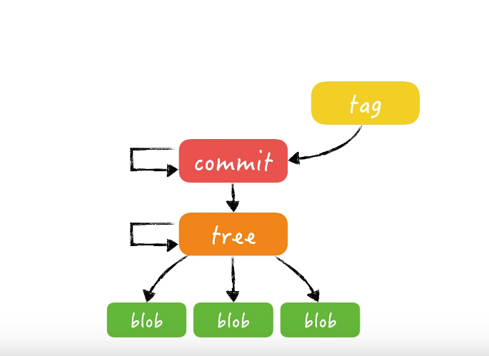
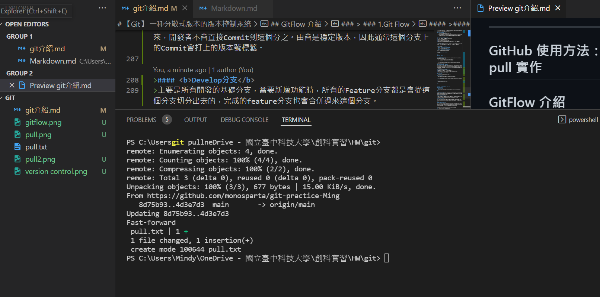

<!--
 * @Author: your name
 * @Date: 2022-02-14 14:37:21
 * @LastEditTime: 2022-02-17 11:25:20
 * @LastEditors: Please set LastEditors
 * @Description: 打开koroFileHeader查看配置 进行设置: https://github.com/OBKoro1/koro1FileHeader/wiki/%E9%85%8D%E7%BD%AE
 * @FilePath: \GIT\git介紹.md
-->
# 【Git】 一種分散式版本的版本控制系統　 

## 基本介紹 

### GIT 簡略歷史
><li> 1991年，linus編寫了linux的內核代碼，並於此年年底公開了部分代碼
><li> Linux的維護成本都花費在了提交修補程式和保存歸檔，基本都是手動合併來自世界各地的代碼
><li>2002年，BitMover出於人道主以，將收費的分布式版本控制工具bitkeeper給Linux開源社區來管理liux代碼
><li>2005年，samba開源者Andrew試圖破解bitkeeper，然後被監測到，BitMover 公司和社區分開，並回收的 bitkeeper 的使用權
><li>同年，Linus關閉兩星期，以「速度」、「簡單設計」、「對非線性開發模式強力支持」、「完全分布式」、「有能力高效管理類似Linux內核一樣的超大規模項目」為目標的git誕生了！
><li>2008年Github上線

### 使用緣由
> 使用git來追蹤每個檔案加入、修改與刪除的紀錄，檢查正在編輯的文件與雲端最新的版本是否一致，也可以避免群組共享的檔案因使用順序而被覆蓋

### 何為版本控制？
>版本控制系統是一種軟體，可協助追蹤在程式碼中隨著時間變更的變更。 當開發人員編輯程式碼時，版本控制系統會取得檔案的快照集。 然後，它會永久儲存該快照集，以便稍後視需要重新叫用。
> #### 版本控制能協助達到什麼目的：

> 1. 可隨時復原修改，回到之前的版本
> 2. 多人協作時，不會將他人的成品覆蓋掉
> 3. 保留修改歷史紀錄，以供查詢
> 4. 軟體發行時，方便管理不同版本 

> #### 版本控制的定義
> 1. 建立Repository(儲存庫)，用來保存程式碼
> 2. 方便散佈程式給團隊，有效偕同開發
> 3. 記錄誰改變什麼、改變時間與改變的緣由
> 4. Branch （分支），可因不同情境分開開發
> 5. Tag重要里程碑，以便參考

> #### 而版本控制的不同模式
> <li> Local VCS
>      本地端使用copy past進行資料夾管理，例如rcs。缺點是無法協同開發。
> <li> Centralized VCS (Lock型，悲觀鎖定) 
>  中央團隊共用的Repository，當有人要編輯某個檔案時，進行鎖定，以避免其他人也同時編輯造成衝同。
> <li>Centralized VCS(Merge型，樂觀鎖定) 
>  中央團隊共用的Repository，但是不用Lock避免衝突，而是事後發現如果有別人也修改同一個檔案(發生衝突)，再進行手動編修解決，如：CVS、Subversion與Perforce等等都屬於這一型
>  <b>兩者的共通缺點就是做什麼事都需要根伺服器連線，也有單點故障的風險</b>
><li> Distributed VCS 
>  分散式版本控制系統讓本地端也擁有完整的Repository，就沒有上述的集中式的問題，即使沒有用路也可以照常Commit 和看 history log，也不用擔心server備份。

> #### 版本控制的優點
> * 建立工作流程
> 防止每個人使用自己的開發流程和搭配不同和不相容工具的混亂。提供程式強制執行和許可權，讓每個人保持在相同的頁面上。
> * 使用版本
>   每個版本會簡單描述變更的用途，協助開發小組遵循程式碼中的版本變更，而不是個別的檔案變更。您可以視需要隨時從版本控制中察看和還原儲存在版本中的程式碼。
> * 一起撰寫程式碼
>   版本控制會同步處理版本，並確保變更不會與其它變更發生衝突。協助解決和防止衝突，即使使用者同時進行變更也是如此。
> * 保留歷程記錄
>  複習歷程記錄，以找出誰、為何，以及何時進行變更。 歷程記錄讓團隊有信心進行實驗，因為隨時都可以輕鬆地復原到先前的良好版本。 歷程記錄讓任何人都能以任何版本的程式碼做為基礎，例如修正先前版本中的 bug。
> * 自動化工作
> 節省時間並產出一致的結果，當心版本儲存在版本控制時，自動進行測試、程式碼分析和部屬。

## 版本控制（workflow）的邏輯說明

>在說明邏輯前，我們必須先知道一些基本知識
 

>* 什麼是版本：每完成一個任務，檔案與目錄每一次的狀態變化
>* Git 只是個內容追蹤軟體，僅在乎內容不在乎檔案或目錄的名稱
> * Git 是拍快照的方式記錄檔案之間的差異
> * Git 物件的檔名以SHA1演算法
> * Git物件的內容為檔案內容+壓縮

> ###  Git 中的四個基本物件：
>> 1. blob物件：跟檔案內容有關,當執行git add指令的同時，新增檔案的內容會被寫入blob物件，檔名則為物件內容的雜湊運算結果，<b>檔案時間、原本的檔名或其他資訊則是儲存到tree的物件</b>

>> 2. tree物件：與目錄資訊相關，會儲存特定目錄下的所有資訊、包含該目錄下的檔名、對應的blob物件名稱、檔案連結（symbolic link）或其他tree物件。簡單來說就是tree物件是特定版本下某個資料夾的快照。

>> 3. commit：用來記錄有哪些tree物件包含在版本中，一個Commit物件代表著git一次的提交，紀錄定接版本中有那些tree物件、以及版本提交的時間、紀錄訊息等等。通常還會記錄上一層commit物件名稱。

>> 4. tag：是一個容器，通常用來關聯一個Commit物件（也可以關聯到特定blob、tree物件），並儲存一些額外的參考資訊。EX：tag名稱。通常大多使用tag是為了將某版本的commit物件標記特殊意義的名稱或發行版本。

> ### 闡述觀念間的關係
>1. 要使用Git版本控制，必須建立「工作目錄」與「版本庫」。(mkdir、git init)
>2. 你要先在「工作目錄」進行開發，如建立目錄、建立檔案、修改檔案等操作。
>3. 然後當你想提交一個新版本Git到「儲存庫」裡，一定要先更新「索引」狀態。（git add,git mv,）
>4. Git 會依據「索引」當下的狀態，決定把那些檔案提交到Git的「儲存庫」裡。
>5. 最後提交變更時（git commit），才會把版本資訊寫到「物件儲存區」當中（寫入commit物件）。

> * 要看出blob檔案版本間的關係，就要透過tree物件（資料夾的快照）與Commit物件（每一個版本之間的快照），才能關聯出blob與版本的關係。

> ### Git 如何存放這些物件
> * 所有物件都會以zlib演算法進行壓縮，不僅提升檔案存取效率也在日後的封裝（pack）的時候也可以利用差異壓縮（delta compression）演算法來節省間，並自動找出相似的blobs，並自動計算出blob之間的變化差異，再將這些差異儲存名為packfile的檔案中，大幅節省磁碟空間的耗用。

> ### 整個運作邏輯範例
> 1. 當你開始把檔案交到戰存區後，blob物件便開始生成
> 2. 提交commit指令，開始生成tree物件，由tree物件紀錄檔案與目錄等資訊，因此會指向目錄與物件也可能指向其他的tree物件
> 3. <b> 完成 </b>commit 之後，會生成commit物件，commit物件會指向方才的tree與前一個commit物件
> 4. tag物件會指向某個commit物件

> ### 第一次commit實際運作說明
> 1. 當你新增一個檔案的時候，檔案通常為untrack
> 2. git add 會將檔案放置git站存區，此時blob物件便開始生成
> 3. git commit 後，git 根據造出tree物件，tree物件會指向它所包含的blob物件，以及上衣個tree物件
> 4. commit在指向tree物件
> 5. 目前的master物件指向新的commit，head再指向master

> ### 第二次commit實際運作說明
> 6. 修改blob內容，檔案狀態為modified
> 7. 再使用add使用加入暫存區後，由於檔案不一樣，因此根據SHA1演算法會生成新的blob物件
> 8. 因而又生成新的tree物件來對應新的blob物件，但由於有一個blob（原先有兩個但只有跟動一個）並沒有改變，因此此tree 除了指向新的blob外，也會指向未改變的blob
> 9. 為了新的tree也會生成一個新的commit，此commit除了會指向新的tree外也會指向上一個commit
> 10. master 與 head 會往前至新的commit

> ### 第三次commit實際運作說明
> 11. 前面有提及，git是以檔案內容變更為依據。因此如果現在新增一個 <b>檔名不同但內容與第二次commit相同的內容</b>後會發生什麼事呢？
> 12. git add 後便<b>不會</b>生成新的blob！
> 13. git commit 後產生的新物件會指向<b>內容已存在的blob</b>以及沒有異動的blob物件
> 14. 因應新的tree會生成相對應的commit，會指向新的tree與上一個commit 
> 15. master 與 head 會往前至新的commit

> 
> ### 物件結構的優點
> #### * 有效率的處理大型專案
>> 不僅僅是完整的版本庫會複製（clone）一份在本機，由於所有的blob物件都是透過「內容」來定址的（content addressable），因此不同版本之間找尋相同的內容，效率是非常高的。
> #### 歷史紀錄保護
>>Git版控的過程，每次提交變更都會產生一個Commit物件，而這個Commit物件的名稱又是透過commit物件的內容產生。再者，Commit物件會關聯到tree物件，tree物件的名稱又是關聯到blob與tree物件，在一層層的關聯下去，要竄改某個版本的歷史紀錄困難度很高。 由於儲存庫經常被clone或fork，只要是被clone過的儲存庫，來源的儲存庫只要任何一個物件被修改，這些clone出去的儲存就很難再合併回來，幾乎不可能任意竄改版本紀錄。

>#### 定期的封裝物件
>>只要專案中的程式碼或檔案被更新，內容不一樣時，Git就會建立一個新的物件，不同內容的檔案將會被保存下來 由於當專案擴大時，過多的檔案會導致存取越來越沒效率，因此Git設計有幾個機制可使一群老舊的「物件」自動封裝進一個封裝檔（packfile），以改善檔案存取效率。 新檔案依舊會以單一檔案的方式存在，然後某隔一段時間就會被重新封裝（repacking）。

> #### SHA1演算法補充：
>* 40個16進位字元組成
>* 很微小的機率才會有碰撞

> #### Git中Blob物件的SHA1計算公式如下：
>> 1. 「blob」字樣
>> 2. 1個空白字元
>> 3. 輸入內容長度
>> 4. Null 結束符號
>> 5. 輸入內容

> ### 補充關於差分編碼編碼邏輯（workflow）
>版本號由3部分構成，即主版本號+次版本號+修改號。
  <b>1號位：主版本</b>：只有當系統在結構和功能上有重大突破改進後才發生變化
 <b>2號位：次版本</b>
 <b>剩餘號位:依照不同方法有細微的區分</b>

##  Git 常用指令集介紹

>  <code>git init</code>
> 
>建立一個Git新的Repository（倉庫）

> <code> git clone </code>
> 
>複製別人的Repository 當你想要抓別人的程式碼自己修改時

> <code> git status </code>
> 
>檢查git的狀態

> <code> git add （.）</code>
> 
>讓檔案能被git追蹤

> <code>git commit -m "" </code>
> 
>提交檔案，讓你未來可以回溯與追蹤參考

> <code> git log (--stat/-p) </code>
> 
>查看過去的commit紀錄。--stat是提交詳細內容;--p參數可以看到檔案更詳細的變更內容。

> <code> git rm '檔案名稱' </code>
> 
>刪除目錄快取的此檔案與工作目錄下的此檔案

> <code> git mv "原先名稱" "新改的名稱" </code>
> 
>用來變更檔案或目錄的名稱

> <code> git reset　(--hard) </code>
>  
>重製目前工作目錄的「索引狀態」，但是是無法拯救已被更動或刪除的檔案或目錄。參數hard可以還原到目前最新版

> <code> git checkout "分支" "檔案名稱" </code>
> 
>救回被改壞的檔案回溯到沒修改前的版本

> <code> git diff </code>
> 
>檢視修改內容

> <code> git branch </code>
> 
>建立分支

> <code> git branch -d </code>
>  
>刪掉分支

> <code>git push origin "分支名稱" </code>
>  
>把本地端的分支推到遠端

> <code> git rebase "branch" </code>
>  
>以某分為基底重接

> <code> git merge （branch）</code>
> 
>比較兩個檔案後合併分支
## .gitignore 配置
>使用gitignore可以忽略一些不需要上傳的文件，使得這些文件不被git識別和追蹤，也部會被上傳到github被別人看到

>### 選擇忽略的文件原則：
> 1. 忽略系統自動生成的文件，EX：縮圖
> 2. 忽略編譯生成的中間文件，可執行文件等，也就是如果一個文件是通過另一個文件自動生成的，那自動生成的文件就沒必要放到git中，EX：.class文件
> 3. 忽略你自己的帶有敏感信息的配置文件，比如存放口令的配置文件

>### .gitignore 文件的格式規範
>* 所有空行或者以 # 開頭的行都會被git忽略
>* 可以使用標準的glob模式匹配
>* 匹配模式可以以(/)開頭防止遞歸
>* 匹配模式可以以(/)結尾指定目錄
>* 要忽略指定模式以外的文件或目錄，可以在模式前加上驚嘆號取反
    
## 分支的使用方法
> 在版本控制中的分支「機制」，主要目的是為了解決開發過程中版本衝突的問題，然而同時也不少的版本問也是因為開始使用分支後而產生的。
>是指向某個commit的指標

> <code> git branch "分支名稱" </code>
> 
>建立一個分支

> <code> git checkout -b "已有分支名稱" </code>
> 
>將目前工作目錄切換到已有的分支

> <code> git checkout -b "新的分支名稱"</code>
> 
>建立一個新得分支並切換到新的分支

> <code> git branch -d "分支名稱"</code>
> 
>刪除分支

## Commit 介紹及使用

>### Commit版控的基本原則
> 在git中大多使用git commit 來建立許多的版本，要有一個好的「版本紀錄」，可以遵從以下原則：
> * 做一個小工能修改就建立版本，容易追蹤變更

> * 千萬不要累積一大堆修改後才建立一個大版本

> * 有邏輯、有順序的修正功能，確保相關的版本修正可以按順序提交（commit），以便追蹤

>### 修正Commit歷史紀錄的理由
>由於git開放每個人都能夠任意的修正Commit歷史紀錄，因此若有人任意竄改版本，會使Git版本控管無法正常運作。但正因為有些情境需要修改版本紀錄，所以Git保留了這樣的機制，希望使用者能在「自我控管版本」到一定的程度後，能有機會整理版本紀錄的各種資訊，讓程式正式發布後他人可以更清楚你版本做了哪一些地修改。
>#### 修改版本歷史紀錄需要特別注意：
>* 一個儲存庫可以有許多分之
>* 分享Git原始碼得最小單位是以「分支」為單位
>* 可以任意修改某個支線上的版本，在你「分享」給其他人前
>* 分享後便不要隨意地再更動了

> <code> git reset </code>
> 
> 可以重製工作目錄與修正版本歷史紀錄

> <code> git revert </code>
> 
> 把某個版本的變更，透過「相反」的步驟把變更給還原

> <code> git cherry-pick </code>
> 
> 一個將要廢棄的分支中手動挑出想要套用的版本變更，重新套用完全的變更

> <code> git rebase　"分支" </code>
> 
> 真正的修改Commit紀錄用途，

## GitHub 使用方法：push, pull 實作
在Git上面新增一個txt檔後pull下來
### Git pull 前的遠端與本地端

### Git pull後的遠端與本地端

### Git push成功（使用Conventional Commit）
> 
> 
## GitFlow 介紹
> ### 1.Git Flow
> 根據建議主要分支有：master、develop、hotfix、release與feature
>
 

>#### <b>Master分支</b>
>主要用來放穩定、確定要上線的版本。通常此分支的來源是從別的分支合併過來，開發者不會直接Commit到這個分之。由會是穩定版本，因此通常這個分支上的Commit會打上的版本號標籤。

>#### <b>Develop分支</b>
>主要是所有開發的基礎分支，當要新增功能時，所有的Feature分支都是會從這個分支切分出去的，完成的feature分支也會合併過來這個分支。

>#### <b>Hotfix分支</b>
>當線上的產品發生緊急問題時，會從Master分支開一個Hotfix分支出來進行修復，Hotfix分支修復完後，會合併回Master分支，同時合併一分到Develop分支。

>#### <b>Release分支</b>
>當認為Develop分支夠成熟了，就可以把Develop分支合併到Release分支，在這邊進行算是上線前的最後測試。測試完成後會同時合併到Master分支與Develop這兩個分支上。同步到Develop分支的目的，是因為可能在Release分支上還會測到並修正一些問題，所以需要跟Develop分支同步。

## git 進階指令
> <code> git gc </code>
> 
>手動將過期且不被使用的物件清除掉

> <code> git fsck </code>
> 
> 檢查Git維護的檔案系統是否完整

> <code> git hash-object </code>
>  
> 計算出Blob的SHA1的值

## 雜紀錄

> ### git add . V.S. git add -all 的差別
><b> -all 是不管專案的哪一層皆會作用   . 為執行檔案的同一層以及子目錄作用</b>

參考資料：
<li>https://www.dazhuanlan.com/lunny/topics/1191001
<li> https://git-scm.com/book/zh/v2/%E8%B5%B7%E6%AD%A5-Git-%E7%AE%80%E5%8F%B2
<li> https://ihower.tw/git/vcs.html
<li>https://zh.wikipedia.org/wiki/%E7%89%88%E6%9C%AC%E6%8E%A7%E5%88%B6
<li>http://blog.gogojimmy.net/2012/01/17/how-to-use-git-1-git-basic/
<li>https://github.com/hahaicanfly/Learn-Git-in-30-days/blob/master/zh-tw/04.md
<li>https://ithelp.ithome.com.tw/articles/10241407

<li>https://gitbook.tw/chapters/gitflow/why-need-git-flow
<li>https://codertw.com/%E7%A8%8B%E5%BC%8F%E8%AA%9E%E8%A8%80/691970/#outline__4
<li>https://docs.vmware.com/tw/vRealize-Orchestrator/8.2/com.vmware.vrealize.orchestrator-dev.doc/GUIDF215F095-27BF-45BE-BC24-E7FCCAC21595.html
<li>https://blog.csdn.net/le_17_4_6/article/details/92789993

<li>https://github.com/hahaicanfly/Learn-Git-in-30-days/blob/master/zh-tw/08.md

<li>https://github.com/hahaicanfly/Learn-Git-in-30-days/blob/master/zh-tw/18.md
<li>https://www.youtube.com/watch?v=LgTf7m5B0xA

太複雜改天再跟著教學研究
https://github.com/hahaicanfly/Learn-Git-in-30-days/blob/master/zh-tw/23.md
