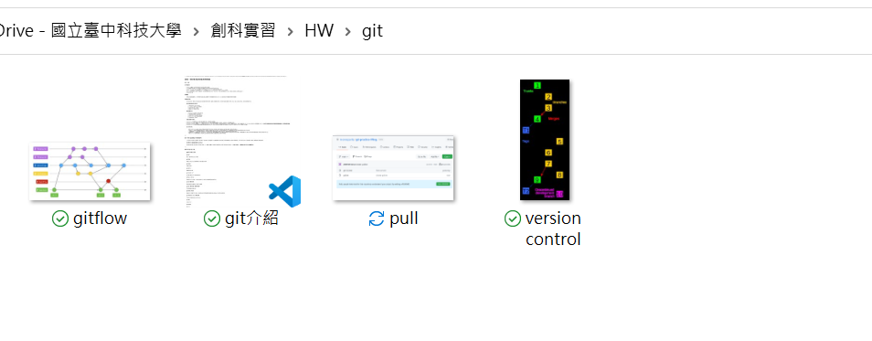

<!--
 * @Author: your name
 * @Date: 2022-02-14 14:37:21
 * @LastEditTime: 2022-02-16 11:21:41
 * @LastEditors: Please set LastEditors
 * @Description: 打开koroFileHeader查看配置 进行设置: https://github.com/OBKoro1/koro1FileHeader/wiki/%E9%85%8D%E7%BD%AE
 * @FilePath: \GIT\git介紹.md
-->
# 【Git】 一種分散式版本的版本控制系統　 

## 基本介紹 

### GIT 簡略歷史
><li> 1991年，linus編寫了linux的內核代碼，並於此年年底公開了部分代碼
><li> Linux的維護成本都花費在了提交修補程式和保存歸檔，基本都是手動合併來自世界各地的代碼
><li>2002年，BitMover出於人道主以，將收費的分布式版本控制工具bitkeeper給Linux開源社區來管理liux代碼
><li>2005年，samba開源者Andrew試圖破解bitkeeper，然後被監測到，BitMover 公司和社區分開，並回收的 bitkeeper 的使用權
><li>同年，Linus關閉兩星期，以「速度」、「簡單設計」、「對非線性開發模式強力支持」、「完全分布式」、「有能力高效管理類似Linux內核一樣的超大規模項目」為目標的git誕生了！
><li>2008年Github上線

### 使用緣由
> 使用git來追蹤每個檔案加入、修改與刪除的紀錄，檢查正在編輯的文件與雲端最新的版本是否一致，也可以避免群組共享的檔案因使用順序而被覆蓋

### 何為版本控制？
>版本控制系統是一種軟體，可協助追蹤在程式碼中隨著時間變更的變更。 當開發人員編輯程式碼時，版本控制系統會取得檔案的快照集。 然後，它會永久儲存該快照集，以便稍後視需要重新叫用。
> #### 版本控制能協助達到什麼目的：

> 1. 可隨時復原修改，回到之前的版本
> 2. 多人協作時，不會將他人的成品覆蓋掉
> 3. 保留修改歷史紀錄，以供查詢
> 4. 軟體發行時，方便管理不同版本 

> #### 版本控制的定義
> 1. 建立Repository(儲存庫)，用來保存程式碼
> 2. 方便散佈程式給團隊，有效偕同開發
> 3. 記錄誰改變什麼、改變時間與改變的緣由
> 4. Branch （分支），可因不同情境分開開發
> 5. Tag重要里程碑，以便參考

> #### 而版本控制的不同模式
> <li> Local VCS
>      本地端使用copy past進行資料夾管理，例如rcs。缺點是無法協同開發。
> <li> Centralized VCS (Lock型，悲觀鎖定) 
>  中央團隊共用的Repository，當有人要編輯某個檔案時，進行鎖定，以避免其他人也同時編輯造成衝同。
> <li>Centralized VCS(Merge型，樂觀鎖定) 
>  中央團隊共用的Repository，但是不用Lock避免衝突，而是事後發現如果有別人也修改同一個檔案(發生衝突)，再進行手動編修解決，如：CVS、Subversion與Perforce等等都屬於這一型
>  <b>兩者的共通缺點就是做什麼事都需要根伺服器連線，也有單點故障的風險</b>
><li> Distributed VCS 
>  分散式版本控制系統讓本地端也擁有完整的Repository，就沒有上述的集中式的問題，即使沒有用路也可以照常Commit 和看 history log，也不用擔心server備份。

> #### 版本控制的優點
> * 建立工作流程
> 防止每個人使用自己的開發流程和搭配不同和不相容工具的混亂。提供程式強制執行和許可權，讓每個人保持在相同的頁面上。
> * 使用版本
>   每個版本會簡單描述變更的用途，協助開發小組遵循程式碼中的版本變更，而不是個別的檔案變更。您可以視需要隨時從版本控制中察看和還原儲存在版本中的程式碼。
> * 一起撰寫程式碼
>   版本控制會同步處理版本，並確保變更不會與其它變更發生衝突。協助解決和防止衝突，即使使用者同時進行變更也是如此。
> * 保留歷程記錄
>  複習歷程記錄，以找出誰、為何，以及何時進行變更。 歷程記錄讓團隊有信心進行實驗，因為隨時都可以輕鬆地復原到先前的良好版本。 歷程記錄讓任何人都能以任何版本的程式碼做為基礎，例如修正先前版本中的 bug。
> * 自動化工作
> 節省時間並產出一致的結果，當心版本儲存在版本控制時，自動進行測試、程式碼分析和部屬。

## 版本控制（workflow）的邏輯說明
>工作流即為工作流程時，從架構中的一個元素到下一個元素的工作流程進展，可以從連結架構中的元素來定義工作流程的邏輯流程，也就是分支管理政策。
>工作流不涉及任何命令，因為他就是一個規則，由開發者進行定義並且遵守。

> ### 補充關於差分編碼編碼邏輯（workflow）
>版本號由3部分構成，即主版本號+次版本號+修改號。
  <b>1號位：主版本</b>：只有當系統在結構和功能上有重大突破改進後才發生變化
 <b>2號位：次版本</b>
 <b>剩餘號位:依照不同方法有細微的區分</b>

##  Git 常用指令集介紹

>## git 基本建立流程
> ### git init
>建立一個Git新的Repository（倉庫）

>### git clone
>複製別人的Repository 當你想要抓別人的程式碼自己修改時

> ### git status
>檢查git的狀態

> ### git add （.）
>讓檔案能被git追蹤

> ### git commit -m ""
>提交檔案，讓你未來可以回溯與追蹤參考

> ### git log (--stat/-p)
>查看過去的commit紀錄。--stat是提交詳細內容;--p參數可以看到檔案更詳細的變更內容。

>### git rm '檔案名稱'
>刪除目錄快取的此檔案與工作目錄下的此檔案

>### git mv "原先名稱" "新改的名稱"
>用來變更檔案或目錄的名稱

>### git reset　(--hard)
>重製目前工作目錄的「索引狀態」，但是是無法拯救已被更動或刪除的檔案或目錄。參數hard可以還原到目前最新版

>### git checkout "分支" "檔案名稱"
>救回被改壞的檔案回溯到沒修改前的版本

>### git diff
>檢視修改內容

>### git branch
>建立分支

>### git branch -d
>刪掉分支

>### git push origin "分支名稱"
>把本地端的分支推到遠端

>### git rebase "branch" 
>以某分為基底重接

>### git merge （branch）
>比較兩個檔案後合併分支
## .gitignore 配置
>使用gitignore可以忽略一些不需要上傳的文件，使得這些文件不被git識別和追蹤，也部會被上傳到github被別人看到

>### 選擇忽略的文件原則：
> 1. 忽略系統自動生成的文件，EX：縮圖
> 2. 忽略編譯生成的中間文件，可執行文件等，也就是如果一個文件是通過另一個文件自動生成的，那自動生成的文件就沒必要放到git中，EX：.class文件
> 3. 忽略你自己的帶有敏感信息的配置文件，比如存放口令的配置文件

>### .gitignore 文件的格式規範
>* 所有空行或者以 # 開頭的行都會被git忽略
>* 可以使用標準的glob模式匹配
>* 匹配模式可以以(/)開頭防止遞歸
>* 匹配模式可以以(/)結尾指定目錄
>* 要忽略指定模式以外的文件或目錄，可以在模式前加上驚嘆號取反
    
## 分支的使用方法
> 在版本控制中的分支「機制」，主要目的是為了解決開發過程中版本衝突的問題，然而同時也不少的版本問也是因為開始使用分支後而產生的。
>是指向某個commit的指標

> ### git branch "分支名稱"
>建立一個分支
> ### git checkout -b "已有分支名稱"
>將目前工作目錄切換到已有的分支

> ### git checkout -b "新的分支名稱"
>建立一個新得分支並切換到新的分支

>### git branch -d "分支名稱"
>刪除分支

## Commit 介紹及使用

>### Commit版控的基本原則
> 在git中大多使用git commit 來建立許多的版本，要有一個好的「版本紀錄」，可以遵從以下原則：
> * 做一個小工能修改就建立版本，容易追蹤變更

> * 千萬不要累積一大堆修改後才建立一個大版本

> * 有邏輯、有順序的修正功能，確保相關的版本修正可以按順序提交（commit），以便追蹤

>### 修正Commit歷史紀錄的理由
>由於git開放每個人都能夠任意的修正Commit歷史紀錄，因此若有人任意竄改版本，會使Git版本控管無法正常運作。但正因為有些情境需要修改版本紀錄，所以Git保留了這樣的機制，希望使用者能在「自我控管版本」到一定的程度後，能有機會整理版本紀錄的各種資訊，讓程式正式發布後他人可以更清楚你版本做了哪一些地修改。
>#### 修改版本歷史紀錄需要特別注意：
>* 一個儲存庫可以有許多分之
>* 分享Git原始碼得最小單位是以「分支」為單位
>* 可以任意修改某個支線上的版本，在你「分享」給其他人前
>* 分享後便不要隨意地再更動了

>### git reset
> 可以重製工作目錄與修正版本歷史紀錄

>### git revert
> 把某個版本的變更，透過「相反」的步驟把變更給還原

>### git cherry-pick
> 一個將要廢棄的分支中手動挑出想要套用的版本變更，重新套用完全的變更

>### git rebase　"分支"
> 真正的修改Commit紀錄用途，

## GitHub 使用方法：push, pull 實作
在Git上面新增一個txt檔後pull下來
### Git pull 前的遠端與本地端

### Git pull後的遠端與本地端

### Git push成功（使用Conventional Commit）
> 
> 
## GitFlow 介紹
> ### 1.Git Flow
> 根據建議主要分支有：master、develop、hotfix、release與feature
>
 

>#### <b>Master分支</b>
>主要用來放穩定、確定要上線的版本。通常此分支的來源是從別的分支合併過來，開發者不會直接Commit到這個分之。由會是穩定版本，因此通常這個分支上的Commit會打上的版本號標籤。

>#### <b>Develop分支</b>
>主要是所有開發的基礎分支，當要新增功能時，所有的Feature分支都是會從這個分支切分出去的，完成的feature分支也會合併過來這個分支。

>#### <b>Hotfix分支</b>
>當線上的產品發生緊急問題時，會從Master分支開一個Hotfix分支出來進行修復，Hotfix分支修復完後，會合併回Master分支，同時合併一分到Develop分支。

>#### <b>Release分支</b>
>當認為Develop分支夠成熟了，就可以把Develop分支合併到Release分支，在這邊進行算是上線前的最後測試。測試完成後會同時合併到Master分支與Develop這兩個分支上。同步到Develop分支的目的，是因為可能在Release分支上還會測到並修正一些問題，所以需要跟Develop分支同步。

## git 進階指令
> ### git gc 
>手動將過期且不被使用的物件清除掉

> ### git fsck
> 檢查Git維護的檔案系統是否完整
>

## 雜紀錄

> ### git add . V.S. git add -all 的差別
><b> -all 是不管專案的哪一層皆會作用   . 為執行檔案的同一層以及子目錄作用</b>

參考資料：
<li>https://www.dazhuanlan.com/lunny/topics/1191001
<li> https://git-scm.com/book/zh/v2/%E8%B5%B7%E6%AD%A5-Git-%E7%AE%80%E5%8F%B2
<li> https://ihower.tw/git/vcs.html
<li>https://zh.wikipedia.org/wiki/%E7%89%88%E6%9C%AC%E6%8E%A7%E5%88%B6
<li>http://blog.gogojimmy.net/2012/01/17/how-to-use-git-1-git-basic/
<li>https://github.com/hahaicanfly/Learn-Git-in-30-days/blob/master/zh-tw/04.md
<li>https://ithelp.ithome.com.tw/articles/10241407

<li>https://gitbook.tw/chapters/gitflow/why-need-git-flow
<li>https://codertw.com/%E7%A8%8B%E5%BC%8F%E8%AA%9E%E8%A8%80/691970/#outline__4
<li>https://docs.vmware.com/tw/vRealize-Orchestrator/8.2/com.vmware.vrealize.orchestrator-dev.doc/GUIDF215F095-27BF-45BE-BC24-E7FCCAC21595.html
<li>https://blog.csdn.net/le_17_4_6/article/details/92789993

<li>https://github.com/hahaicanfly/Learn-Git-in-30-days/blob/master/zh-tw/08.md

<li>https://github.com/hahaicanfly/Learn-Git-in-30-days/blob/master/zh-tw/18.md

太複雜改天再跟著教學研究
https://github.com/hahaicanfly/Learn-Git-in-30-days/blob/master/zh-tw/23.md
